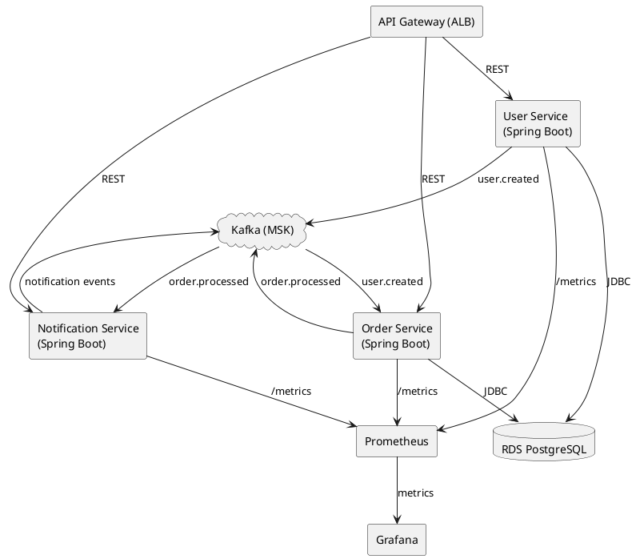

# Cloud-Native Microservices Platform: Design Document

⸻

## 1. Overview

This project builds a cloud-native microservices platform with three loosely coupled services—User, Order, Notification—demonstrating event-driven architecture, infrastructure as code, and full observability. The platform uses Kotlin (Spring Boot) or Go (Gin) for services, PostgreSQL for persistence, and Kafka (MSK) for asynchronous events. Deployment targets AWS via Terraform for reproducibility. Monitoring/alerting is provided via Prometheus and Grafana.

⸻

## 2. Goals and Objectives

* End-to-end microservices lifecycle: Develop, test, deploy, monitor, and maintain microservices using best industry practices.
* Event-driven workflows: Showcase decoupling and asynchronous communication using Kafka.
* Infrastructure-as-Code: Apply modular Terraform to manage all AWS infrastructure.
* Observability: Instrument all services, collect metrics, and visualize in Grafana.
* Security & Compliance: Enforce least-privilege, encryption, and secure inter-service comms.

⸻

3. Scope

* Microservices:
  * user-service
  * order-service
  * notification-service
* Infrastructure Modules:
  * VPC, RDS (PostgreSQL), MSK (Kafka), ECS/EKS, IAM, ALB/API Gateway
* Observability:
  * Prometheus scraping each service, Grafana dashboards
* Documentation:
  * README, architecture diagrams, example workflows

⸻

## 4. Architecture & Components

### 4.1 High-Level Diagram

```plantuml
[Client] 
   │
   ▼
[API Gateway (ALB)]
   │
 ┌─┼─────────┬────────────┐
 │           │            │
▼           ▼            ▼
[User Svc] [Order Svc] [Notif Svc]
   │           │            │
   ▼           ▼            ▼
[Postgres] [Postgres]    (Stateless)
   │           │
   └─►[Kafka (MSK)]◄──────┘
        │        │
   ┌────┴────┐   │
   ▼         ▼   ▼
(Order, User events)

```

* API Gateway (ALB): Routes external traffic.
* ECS Fargate: Deploys stateless services.
* Kafka (MSK): Core event bus.
* RDS PostgreSQL: Service DBs.
* Prometheus: Scrapes /metrics.
* Grafana: Visualization/alerts.

⸻

## 5. Data Flow

* User Service:
  * Receives REST call, writes to Postgres
  * Emits user.created to Kafka
* Order Service:
  * Consumes user.created, processes orders
  * Writes order to Postgres, emits order.processed
* Notification Service:
  * Consumes events, sends emails/notifications
* Prometheus:
  * Each service exposes /metrics endpoint
  * Prometheus scrapes all, Grafana dashboards visualize metrics

⸻

## 6. Technology Stack

* Backend: Kotlin (Spring Boot) or Go (Gin)
* Messaging: Kafka (AWS MSK)
* Database: PostgreSQL (RDS)
* Container Runtime: ECS Fargate or EKS (Kubernetes)
* Networking: VPC, ALB
* Infrastructure: Terraform 1.x, AWS CLI
* Observability: Prometheus, Grafana

⸻

## 7. Infrastructure as Code

Terraform Modules

* Root infra/
  * modules/vpc/
  * modules/rds/
  * modules/msk/
  * modules/ecs/ or modules/eks/
  * modules/iam/
  * modules/alb/
    * environments/dev/, staging/, prod/
* State management: S3 backend + DynamoDB lock
* CI: Plan/apply via pipeline; validate on PR

⸻

## 8. Non-Functional Requirements

* Availability: ≥ 99.5% (multi-AZ, health checks, auto-recovery)
* Latency: < 200ms avg (API/DB/queue performance tuning)
* Idempotency: Terraform applies and service APIs
* Security: TLS for Kafka, IAM for service accounts, encryption at rest (RDS, MSK)

⸻

## 9. Deployment and Release

* GitOps: All changes via PR/merge in infra/ repo; pipeline triggers terraform plan/apply
* Blue/green deploy: ECS task set swaps or k8s rolling update
* Service rollout: Health checks, automatic rollback on failure

⸻

## 10. Testing & Resilience

* Service-level: Unit/integration tests (JUnit/Go test)
* E2E: Docker Compose for local integration, then ECS/EKS
* Infra: terraform validate and plan checks in CI
* Chaos testing: Randomly terminate tasks/pods to ensure resilience, use AWS Fault Injection Simulator if available

⸻

## 11. Observability & Monitoring

* Prometheus Exporters: Spring Boot actuator/Go promhttp on /metrics
* Prometheus Server: Runs on EC2 or ECS/EKS
* Grafana Dashboards: Pre-built, with alerts for high error rates, latency, saturation
* Drift detection: Monthly terraform plan diff vs. applied state

⸻

## 12. Security

* Kafka (MSK): TLS, IAM authentication
* PostgreSQL: Encrypted storage, restricted security group access
* ECS/EKS: Task roles with least privilege, separate network for backend
* ALB: HTTPS only, WAF (optional)
* Secret Management: AWS Secrets Manager for DB/Kafka creds

⸻

## 13. Maintenance Plan

* Monthly: Drift detection, patching base images, review IAM policies
* On-call: PagerDuty/SNS alerts for Grafana triggers

⸻

## 14. Timeline & Milestones

Week | Milestone
--- | ---
1 | Scaffold services (local Docker Compose)
2 | Terraform infra MVP (VPC, RDS, MSK, ECS)
3 | Kafka integration, end-to-end event flows
4 | Observability, dashboards, documentation

⸻

## Local Development Setup

To run the microservices locally, follow these steps:

1. Build the services:

```bash
./gradlew build
```

2. Start all services with Docker Compose

```bash
docker-compose -f docker-compose-local.yml up
```

The services will be available at:

* User Service: <http://localhost:8081>
* Order Service: <http://localhost:8082>
* Notification Service: <http://localhost:8083>
* PostgreSQL: localhost:5432
* Kafka: localhost:9092

⸻

## 15. Future Enhancements (Out of Scope but Recommended)

* Service mesh (Istio/App Mesh) for advanced traffic management
* Canary deployments and autoscaling
* Secrets rotation automation
* Full SRE runbook for on-call

⸻

## Appendix

### Example Kafka Event (user.created)

```json
{
  "event_type": "user.created",
  "user_id": "123456",
  "email": "user@domain.com",
  "created_at": "2024-05-23T19:00:00Z"
}
```

### Sample Prometheus Metrics (user-service)

```prometheus

http_requests_total{method="POST",endpoint="/users"} 1234
service_errors_total{service="user-service"} 3

```

### Sample Grafana Dashboard

```json
{
  "title": "User Service Dashboard",
  "panels": [
    {
      "title": "HTTP Requests",
      "type": "graph",
      "datasource": "Prometheus",
      "targets": [
        {
          "expr": "http_requests_total{method=\"POST\",endpoint=\"/users\"}",
          "refId": "A"
        }
      ]
    }
  ]
}
```

⸻

### Diagrams, Prototypes, and Examples

I can provide architecture diagrams (UML, draw.io, or PlantUML format), sample Terraform modules, or boilerplate for Spring Boot/Gin microservices, as well as Prometheus/Grafana configs—just ask for the specifics you want next!

⸻

Stretch Goals:

* A specific architecture diagram (SVG, PlantUML, Markdown)
* Terraform skeleton for one of the modules
* Spring Boot or Go service boilerplate
* Example Kafka producer/consumer code
* Prometheus/Grafana YAMLs
* End-to-end test scenarios

⸻

### 1. High-Level UML Component Diagram (PlantUML)

Paste this into PlantUML Online Editor for a visual diagram.



⸻

### 2. Terraform Skeleton (infra/ Directory Structure)

Directory Layout:

```bash
infra/
├── main.tf
├── variables.tf
├── outputs.tf
├── provider.tf
├── modules/
│   ├── vpc/
│   │   └── (vpc.tf, variables.tf, outputs.tf)
│   ├── rds/
│   │   └── (rds.tf, variables.tf, outputs.tf)
│   ├── msk/
│   │   └── (msk.tf, variables.tf, outputs.tf)
│   ├── ecs/
│   │   └── (ecs.tf, variables.tf, outputs.tf)
│   ├── alb/
│   │   └── (alb.tf, variables.tf, outputs.tf)
│   ├── iam/
│   │   └── (iam.tf, variables.tf, outputs.tf)
│   └── observability/
│       └── (prometheus.tf, grafana.tf)
└── environments/
    ├── dev/
    │   └── (main.tf, variables.tf)
    ├── staging/
    └── prod/
```

### Example: Top-level main.tf

```hcl
module "vpc" {
  source = "./modules/vpc"
  ...
}

module "rds" {
  source = "./modules/rds"
  vpc_id = module.vpc.vpc_id
  ...
}

module "msk" {
  source = "./modules/msk"
  vpc_id = module.vpc.vpc_id
  ...
}

module "ecs" {
  source = "./modules/ecs"
  vpc_id = module.vpc.vpc_id
  ...
}

module "alb" {
  source = "./modules/alb"
  vpc_id = module.vpc.vpc_id
  ...
}

module "iam" {
  source = "./modules/iam"
  ...
}

module "observability" {
  source = "./modules/observability"
  ...
}
```

Each module directory (modules/vpc, modules/rds, etc.) will have its own *.tf files.
Let me know if you want a sample for a specific module (e.g., full VPC or RDS).

⸻

## 3. Spring Boot Service Boilerplate (User Service)

### UserServiceApplication.kt

```kotlin
@SpringBootApplication
class UserServiceApplication

fun main(args: Array<String>) {
    runApplication<UserServiceApplication>(*args)
}
```

#### UserController.kt

```kotlin
@RestController
@RequestMapping("/users")
class UserController(
    private val userService: UserService
) {
    @PostMapping
    fun createUser(@RequestBody req: CreateUserRequest): ResponseEntity<User> =
        ResponseEntity.ok(userService.createUser(req))
}

data class CreateUserRequest(val email: String, val name: String)
```

#### UserService.kt

```kotlin
@Service
class UserService(
    private val userRepository: UserRepository,
    private val kafkaTemplate: KafkaTemplate<String, UserCreatedEvent>
) {
    fun createUser(req: CreateUserRequest): User {
        val user = userRepository.save(User(email = req.email, name = req.name))
        kafkaTemplate.send("user.created", user.id.toString(), UserCreatedEvent(user.id, user.email, user.name))
        return user
    }
}

data class UserCreatedEvent(val id: Long, val email: String, val name: String)
```

#### User.kt (JPA Entity)

```kotlin
@Entity
data class User(
    @Id @GeneratedValue val id: Long = 0,
    val email: String,
    val name: String
)
```

#### UserRepository.kt

```kotlin
interface UserRepository : JpaRepository<User, Long>
```

#### application.yml

```yaml
spring:
  datasource:
    url: jdbc:postgresql://localhost:5432/userdb
    username: user
    password: pass
  kafka:
    bootstrap-servers: localhost:9092

management:
  endpoints:
    web:
      exposure:
        include: health,info,prometheus
```

#### KafkaConfig.kt

```kotlin
@Configuration
class KafkaConfig {
    @Bean
    fun kafkaTemplate(producerFactory: ProducerFactory<String, UserCreatedEvent>): KafkaTemplate<String, UserCreatedEvent> =
        KafkaTemplate(producerFactory)
}
```

#### Prometheus Actuator

Add dependency:

```kotlin
implementation("io.micrometer:micrometer-registry-prometheus")
```

and /actuator/prometheus will expose metrics.

⸻

### 4. Complete Kafka Producer/Consumer Code (Kotlin/Spring Boot Example)

#### Producer (User Service)

```kotlin
// Inside UserService, see above
kafkaTemplate.send("user.created", user.id.toString(), UserCreatedEvent(user.id, user.email, user.name))
```

#### Consumer (Order Service)

```kotlin
@Component
class UserEventListener {
    @KafkaListener(topics = ["user.created"], groupId = "order-service")
    fun handleUserCreated(event: String) {
        val userEvent = ObjectMapper().readValue(event, UserCreatedEvent::class.java)
        // process userEvent
    }
}
```

#### Producer (Order Service)

```kotlin
kafkaTemplate.send("order.processed", order.id.toString(), OrderProcessedEvent(...))
```

#### Consumer (Notification Service)

```kotlin
@Component
class OrderEventListener {
    @KafkaListener(topics = ["order.processed"], groupId = "notification-service")
    fun handleOrderProcessed(event: String) {
        val orderEvent = ObjectMapper().readValue(event, OrderProcessedEvent::class.java)
        // send notification
    }
}
```

#### Kafka Config Example

```kotlin
@Configuration
class KafkaConfig {
    @Bean
    fun consumerFactory(): ConsumerFactory<String, String> {
        val props = HashMap<String, Any>()
        props[ConsumerConfig.BOOTSTRAP_SERVERS_CONFIG] = "localhost:9092"
        props[ConsumerConfig.GROUP_ID_CONFIG] = "order-service"
        props[ConsumerConfig.KEY_DESERIALIZER_CLASS_CONFIG] = StringDeserializer::class.java
        props[ConsumerConfig.VALUE_DESERIALIZER_CLASS_CONFIG] = StringDeserializer::class.java
        return DefaultKafkaConsumerFactory(props)
    }
    @Bean
    fun kafkaListenerContainerFactory(): ConcurrentKafkaListenerContainerFactory<String, String> {
        val factory = ConcurrentKafkaListenerContainerFactory<String, String>()
        factory.consumerFactory = consumerFactory()
        return factory
    }
}
```

⸻

### 5. Fully Featured Prometheus/Grafana Setup

#### Prometheus Configuration (prometheus.yml)

```yaml
global:
  scrape_interval: 15s
scrape_configs:
  - job_name: 'user-service'
    metrics_path: '/actuator/prometheus'
    static_configs:
      - targets: ['user-service:8080']
  - job_name: 'order-service'
    metrics_path: '/actuator/prometheus'
    static_configs:
      - targets: ['order-service:8080']
  - job_name: 'notification-service'
    metrics_path: '/actuator/prometheus'
    static_configs:
      - targets: ['notification-service:8080']
```

#### Grafana Setup

* Add Prometheus as a data source (URL: `http://prometheus:9090`)
* Import Dashboards: Use Spring Boot Micrometer dashboards or build custom ones for:
  * Request rate, latency, error rates per service
  * JVM memory/cpu stats (for Kotlin services)
  * Kafka consumer lag (dashboard example)

#### Docker Compose for local stack

```yaml
version: "3"
services:
  prometheus:
    image: prom/prometheus
    volumes:
      - ./prometheus.yml:/etc/prometheus/prometheus.yml
    ports:
      - "9090:9090"
  grafana:
    image: grafana/grafana
    ports:
      - "3000:3000"
    environment:
      - GF_SECURITY_ADMIN_PASSWORD=admin
```

⸻

### 6. End-to-End Test Suite (Example with Testcontainers for Integration)

#### Add dependencies

```kotlin
testImplementation("org.springframework.boot:spring-boot-starter-test")
testImplementation("org.testcontainers:junit-jupiter")
testImplementation("org.testcontainers:kafka")
testImplementation("org.testcontainers:postgresql")
```

#### Example E2E Test

```kotlin
@SpringBootTest
@AutoConfigureMockMvc
@Testcontainers
class UserOrderE2ETest {
    companion object {
        @Container
        val postgres = PostgreSQLContainer("postgres:13")
        @Container
        val kafka = KafkaContainer("5.5.1")
    }
    @Autowired lateinit var mockMvc: MockMvc

    @Test
    fun `end-to-end user creation emits event and triggers order service`() {
        // 1. Create user via REST
        val userJson = """{"email":"test@acme.com","name":"Jane"}"""
        mockMvc.perform(
            post("/users").contentType(MediaType.APPLICATION_JSON).content(userJson)
        ).andExpect(status().isOk)

        // 2. Assert that a 'user.created' event was published to Kafka
        // (Implement a Kafka consumer to listen and verify the event)

        // 3. Mock or spin up order service to consume and process event

        // 4. Verify order processed event and notification sent (simulate downstream)
    }
}
```

### You can expand this to include

* Full integration with real Kafka and Postgres
* Test notification flow via a mock SMTP server (e.g. GreenMail)
* Chaos tests: Randomly kill service containers during tests and assert recovery

⸻

What Next?

* Architecture Diagram: Use PlantUML code above for high-level architecture.
* Terraform: Copy-paste skeleton; ask for any module in detail.
* Spring Boot: Use code as template; let me know if you want the Order/Notification variants.
* Kafka: Producer/Consumer code included.
* Prometheus/Grafana: Configs and dashboards ready; expand as needed.
* End-to-End Tests: Copy pattern above for each microservice pair.
