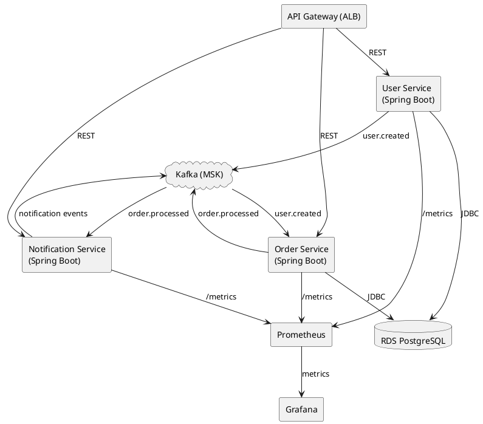

# Cloud-Native Microservices Platform: Design Document

⸻

## 1. Overview

This project builds a cloud-native microservices platform with three loosely coupled services—User, Order, Notification—demonstrating event-driven architecture, infrastructure as code, and full observability. The platform uses Kotlin (Spring Boot) or Go (Gin) for services, PostgreSQL for persistence, and Kafka (MSK) for asynchronous events. Deployment targets AWS via Terraform for reproducibility. Monitoring/alerting is provided via Prometheus and Grafana.

⸻

## 2. Goals and Objectives

* End-to-end microservices lifecycle: Develop, test, deploy, monitor, and maintain microservices using best industry practices.
* Event-driven workflows: Showcase decoupling and asynchronous communication using Kafka.
* Infrastructure-as-Code: Apply modular Terraform to manage all AWS infrastructure.
* Observability: Instrument all services, collect metrics, and visualize in Grafana.
* Security & Compliance: Enforce least-privilege, encryption, and secure inter-service comms.

⸻

3. Scope

* Microservices:
  * user-service
  * order-service
  * notification-service
* Infrastructure Modules:
  * VPC, RDS (PostgreSQL), MSK (Kafka), ECS/EKS, IAM, ALB/API Gateway
* Observability:
  * Prometheus scraping each service, Grafana dashboards
* Documentation:
  * README, architecture diagrams, example workflows

⸻

## 4. Architecture & Components

### 4.1 High-Level Diagram

```plantuml
[Client] 
   │
   ▼
[API Gateway (ALB)]
   │
 ┌─┼─────────┬────────────┐
 │           │            │
▼           ▼            ▼
[User Svc] [Order Svc] [Notif Svc]
   │           │            │
   ▼           ▼            ▼
[Postgres] [Postgres]    (Stateless)
   │           │
   └─►[Kafka (MSK)]◄──────┘
        │        │
   ┌────┴────┐   │
   ▼         ▼   ▼
(Order, User events)

```

* API Gateway (ALB): Routes external traffic.
* ECS Fargate: Deploys stateless services.
* Kafka (MSK): Core event bus.
* RDS PostgreSQL: Service DBs.
* Prometheus: Scrapes /metrics.
* Grafana: Visualization/alerts.

⸻

## 5. Data Flow

* User Service:
  * Receives REST call, writes to Postgres
  * Emits user.created to Kafka
* Order Service:
  * Consumes user.created, processes orders
  * Writes order to Postgres, emits order.processed
* Notification Service:
  * Consumes events, sends emails/notifications
* Prometheus:
  * Each service exposes /metrics endpoint
  * Prometheus scrapes all, Grafana dashboards visualize metrics

⸻

## 6. Technology Stack

* Backend: Kotlin (Spring Boot) or Go (Gin)
* Messaging: Kafka (AWS MSK)
* Database: PostgreSQL (RDS)
* Container Runtime: ECS Fargate or EKS (Kubernetes)
* Networking: VPC, ALB
* Infrastructure: Terraform 1.x, AWS CLI
* Observability: Prometheus, Grafana

⸻

## 7. Infrastructure as Code

Terraform Modules

* Root infra/
  * modules/vpc/
  * modules/rds/
  * modules/msk/
  * modules/ecs/ or modules/eks/
  * modules/iam/
  * modules/alb/
    * environments/dev/, staging/, prod/
* State management: S3 backend + DynamoDB lock
* CI: Plan/apply via pipeline; validate on PR

⸻

## 8. Non-Functional Requirements

* Availability: ≥ 99.5% (multi-AZ, health checks, auto-recovery)
* Latency: < 200ms avg (API/DB/queue performance tuning)
* Idempotency: Terraform applies and service APIs
* Security: TLS for Kafka, IAM for service accounts, encryption at rest (RDS, MSK)

⸻

## 9. Deployment and Release

* GitOps: All changes via PR/merge in infra/ repo; pipeline triggers terraform plan/apply
* Blue/green deploy: ECS task set swaps or k8s rolling update
* Service rollout: Health checks, automatic rollback on failure

⸻

## 10. Testing & Resilience

* Service-level: Unit/integration tests (JUnit/Go test)
* E2E: Docker Compose for local integration, then ECS/EKS
* Infra: terraform validate and plan checks in CI
* Chaos testing: Randomly terminate tasks/pods to ensure resilience, use AWS Fault Injection Simulator if available

⸻

## 11. Observability & Monitoring

* Prometheus Exporters: Spring Boot actuator/Go promhttp on /metrics
* Prometheus Server: Runs on EC2 or ECS/EKS
* Grafana Dashboards: Pre-built, with alerts for high error rates, latency, saturation
* Drift detection: Monthly terraform plan diff vs. applied state

⸻

## 12. Security

* Kafka (MSK): TLS, IAM authentication
* PostgreSQL: Encrypted storage, restricted security group access
* ECS/EKS: Task roles with least privilege, separate network for backend
* ALB: HTTPS only, WAF (optional)
* Secret Management: AWS Secrets Manager for DB/Kafka creds

⸻

## 13. Maintenance Plan

* Monthly: Drift detection, patching base images, review IAM policies
* On-call: PagerDuty/SNS alerts for Grafana triggers

⸻

## 14. Timeline & Milestones

Week | Milestone
--- | ---
1 | Scaffold services (local Docker Compose)
2 | Terraform infra MVP (VPC, RDS, MSK, ECS)
3 | Kafka integration, end-to-end event flows
4 | Observability, dashboards, documentation

⸻

## Local Development Setup

To run the microservices locally, follow these steps:

1. Build the services:

```bash
./gradlew build
```

2. Start all services with Docker Compose

```bash
docker-compose -f docker-compose-local.yml up
```

The services will be available at:

* User Service: <http://localhost:8081>
* Order Service: <http://localhost:8082>
* Notification Service: <http://localhost:8083>
* PostgreSQL: localhost:5432
* Kafka: localhost:9092

⸻

## 15. Future Enhancements (Out of Scope but Recommended)

* Service mesh (Istio/App Mesh) for advanced traffic management
* Canary deployments and autoscaling
* Secrets rotation automation
* Full SRE runbook for on-call

⸻

## Appendix

### Example Kafka Event (user.created)

```json
{
  "event_type": "user.created",
  "user_id": "123456",
  "email": "user@domain.com",
  "created_at": "2024-05-23T19:00:00Z"
}
```

### Sample Prometheus Metrics (user-service)

```prometheus

http_requests_total{method="POST",endpoint="/users"} 1234
service_errors_total{service="user-service"} 3

```

### Sample Grafana Dashboard

```json
{
  "title": "User Service Dashboard",
  "panels": [
    {
      "title": "HTTP Requests",
      "type": "graph",
      "datasource": "Prometheus",
      "targets": [
        {
          "expr": "http_requests_total{method=\"POST\",endpoint=\"/users\"}",
          "refId": "A"
        }
      ]
    }
  ]
}
```

⸻

### Diagrams, Prototypes, and Examples

I can provide architecture diagrams (UML, draw.io, or PlantUML format), sample Terraform modules, or boilerplate for Spring Boot/Gin microservices, as well as Prometheus/Grafana configs—just ask for the specifics you want next!

⸻

Stretch Goals:

* A specific architecture diagram (SVG, PlantUML, Markdown)
* Terraform skeleton for one of the modules
* Spring Boot or Go service boilerplate
* Example Kafka producer/consumer code
* Prometheus/Grafana YAMLs
* End-to-end test scenarios

⸻

### 1. High-Level UML Component Diagram (PlantUML)

Paste this into PlantUML Online Editor for a visual diagram.


```plantuml
    @startuml
    !define RECTANGLE class

    rectangle "API Gateway (ALB)" as alb

    rectangle "User Service\n(Spring Boot)" as user
    rectangle "Order Service\n(Spring Boot)" as order
    rectangle "Notification Service\n(Spring Boot)" as notif

    database "RDS PostgreSQL" as db
    cloud "Kafka (MSK)" as kafka

    rectangle "Prometheus" as prometheus
    rectangle "Grafana" as grafana

    alb --> user : REST
    alb --> order : REST
    alb --> notif : REST

    user --> db : JDBC
    order --> db : JDBC

    user --> kafka : "user.created"
    order --> kafka : "order.processed"
    notif --> kafka : "notification events"

    kafka --> order : "user.created"
    kafka --> notif : "order.processed"

    user --> prometheus : "/metrics"
    order --> prometheus : "/metrics"
    notif --> prometheus : "/metrics"
    prometheus --> grafana : "metrics"

    @enduml

```

⸻

### 2. Terraform Skeleton (infra/ Directory Structure)

Directory Layout:

```bash
infra/
├── main.tf
├── variables.tf
├── outputs.tf
├── provider.tf
├── modules/
│   ├── vpc/
│   │   └── (vpc.tf, variables.tf, outputs.tf)
│   ├── rds/
│   │   └── (rds.tf, variables.tf, outputs.tf)
│   ├── msk/
│   │   └── (msk.tf, variables.tf, outputs.tf)
│   ├── ecs/
│   │   └── (ecs.tf, variables.tf, outputs.tf)
│   ├── alb/
│   │   └── (alb.tf, variables.tf, outputs.tf)
│   ├── iam/
│   │   └── (iam.tf, variables.tf, outputs.tf)
│   └── observability/
│       └── (prometheus.tf, grafana.tf)
└── environments/
    ├── dev/
    │   └── (main.tf, variables.tf)
    ├── staging/
    └── prod/
```

### Example: Top-level main.tf

```hcl
module "vpc" {
  source = "./modules/vpc"
  ...
}

module "rds" {
  source = "./modules/rds"
  vpc_id = module.vpc.vpc_id
  ...
}

module "msk" {
  source = "./modules/msk"
  vpc_id = module.vpc.vpc_id
  ...
}

module "ecs" {
  source = "./modules/ecs"
  vpc_id = module.vpc.vpc_id
  ...
}

module "alb" {
  source = "./modules/alb"
  vpc_id = module.vpc.vpc_id
  ...
}

module "iam" {
  source = "./modules/iam"
  ...
}

module "observability" {
  source = "./modules/observability"
  ...
}
```

Each module directory (modules/vpc, modules/rds, etc.) will have its own *.tf files.
Let me know if you want a sample for a specific module (e.g., full VPC or RDS).

⸻

## 3. Spring Boot Service Boilerplate (User Service)

### UserServiceApplication.kt

```kotlin
@SpringBootApplication
class UserServiceApplication

fun main(args: Array<String>) {
    runApplication<UserServiceApplication>(*args)
}
```

#### UserController.kt

```kotlin
@RestController
@RequestMapping("/users")
class UserController(
    private val userService: UserService
) {
    @PostMapping
    fun createUser(@RequestBody req: CreateUserRequest): ResponseEntity<User> =
        ResponseEntity.ok(userService.createUser(req))
}

data class CreateUserRequest(val email: String, val name: String)
```

#### UserService.kt

```kotlin
@Service
class UserService(
    private val userRepository: UserRepository,
    private val kafkaTemplate: KafkaTemplate<String, UserCreatedEvent>
) {
    fun createUser(req: CreateUserRequest): User {
        val user = userRepository.save(User(email = req.email, name = req.name))
        kafkaTemplate.send("user.created", user.id.toString(), UserCreatedEvent(user.id, user.email, user.name))
        return user
    }
}

data class UserCreatedEvent(val id: Long, val email: String, val name: String)
```

#### User.kt (JPA Entity)

```kotlin
@Entity
data class User(
    @Id @GeneratedValue val id: Long = 0,
    val email: String,
    val name: String
)
```

#### UserRepository.kt

```kotlin
interface UserRepository : JpaRepository<User, Long>
```

#### application.yml

```yaml
spring:
  datasource:
    url: jdbc:postgresql://localhost:5432/userdb
    username: user
    password: pass
  kafka:
    bootstrap-servers: localhost:9092

management:
  endpoints:
    web:
      exposure:
        include: health,info,prometheus
```

#### KafkaConfig.kt

```kotlin
@Configuration
class KafkaConfig {
    @Bean
    fun kafkaTemplate(producerFactory: ProducerFactory<String, UserCreatedEvent>): KafkaTemplate<String, UserCreatedEvent> =
        KafkaTemplate(producerFactory)
}
```

#### Prometheus Actuator

Add dependency:

```kotlin
implementation("io.micrometer:micrometer-registry-prometheus")
```

and /actuator/prometheus will expose metrics.

⸻

### 4. Complete Kafka Producer/Consumer Code (Kotlin/Spring Boot Example)

#### Producer (User Service)

```kotlin
// Inside UserService, see above
kafkaTemplate.send("user.created", user.id.toString(), UserCreatedEvent(user.id, user.email, user.name))
```

#### Consumer (Order Service)

```kotlin
@Component
class UserEventListener {
    @KafkaListener(topics = ["user.created"], groupId = "order-service")
    fun handleUserCreated(event: String) {
        val userEvent = ObjectMapper().readValue(event, UserCreatedEvent::class.java)
        // process userEvent
    }
}
```

#### Producer (Order Service)

```kotlin
kafkaTemplate.send("order.processed", order.id.toString(), OrderProcessedEvent(...))
```

#### Consumer (Notification Service)

```kotlin
@Component
class OrderEventListener {
    @KafkaListener(topics = ["order.processed"], groupId = "notification-service")
    fun handleOrderProcessed(event: String) {
        val orderEvent = ObjectMapper().readValue(event, OrderProcessedEvent::class.java)
        // send notification
    }
}
```

#### Kafka Config Example

```kotlin
@Configuration
class KafkaConfig {
    @Bean
    fun consumerFactory(): ConsumerFactory<String, String> {
        val props = HashMap<String, Any>()
        props[ConsumerConfig.BOOTSTRAP_SERVERS_CONFIG] = "localhost:9092"
        props[ConsumerConfig.GROUP_ID_CONFIG] = "order-service"
        props[ConsumerConfig.KEY_DESERIALIZER_CLASS_CONFIG] = StringDeserializer::class.java
        props[ConsumerConfig.VALUE_DESERIALIZER_CLASS_CONFIG] = StringDeserializer::class.java
        return DefaultKafkaConsumerFactory(props)
    }
    @Bean
    fun kafkaListenerContainerFactory(): ConcurrentKafkaListenerContainerFactory<String, String> {
        val factory = ConcurrentKafkaListenerContainerFactory<String, String>()
        factory.consumerFactory = consumerFactory()
        return factory
    }
}
```

⸻

### 5. Fully Featured Prometheus/Grafana Setup

#### Prometheus Configuration (prometheus.yml)

```yaml
global:
  scrape_interval: 15s
scrape_configs:
  - job_name: 'user-service'
    metrics_path: '/actuator/prometheus'
    static_configs:
      - targets: ['user-service:8080']
  - job_name: 'order-service'
    metrics_path: '/actuator/prometheus'
    static_configs:
      - targets: ['order-service:8080']
  - job_name: 'notification-service'
    metrics_path: '/actuator/prometheus'
    static_configs:
      - targets: ['notification-service:8080']
```

#### Grafana Setup

* Add Prometheus as a data source (URL: `http://prometheus:9090`)
* Import Dashboards: Use Spring Boot Micrometer dashboards or build custom ones for:
  * Request rate, latency, error rates per service
  * JVM memory/cpu stats (for Kotlin services)
  * Kafka consumer lag (dashboard example)

#### Docker Compose for local stack

```yaml
version: "3"
services:
  prometheus:
    image: prom/prometheus
    volumes:
      - ./prometheus.yml:/etc/prometheus/prometheus.yml
    ports:
      - "9090:9090"
  grafana:
    image: grafana/grafana
    ports:
      - "3000:3000"
    environment:
      - GF_SECURITY_ADMIN_PASSWORD=admin
```

⸻

### 6. End-to-End Test Suite (Example with Testcontainers for Integration)

#### Add dependencies

```kotlin
testImplementation("org.springframework.boot:spring-boot-starter-test")
testImplementation("org.testcontainers:junit-jupiter")
testImplementation("org.testcontainers:kafka")
testImplementation("org.testcontainers:postgresql")
```

#### Example E2E Test

```kotlin
@SpringBootTest
@AutoConfigureMockMvc
@Testcontainers
class UserOrderE2ETest {
    companion object {
        @Container
        val postgres = PostgreSQLContainer("postgres:13")
        @Container
        val kafka = KafkaContainer("5.5.1")
    }
    @Autowired lateinit var mockMvc: MockMvc

    @Test
    fun `end-to-end user creation emits event and triggers order service`() {
        // 1. Create user via REST
        val userJson = """{"email":"test@acme.com","name":"Jane"}"""
        mockMvc.perform(
            post("/users").contentType(MediaType.APPLICATION_JSON).content(userJson)
        ).andExpect(status().isOk)

        // 2. Assert that a 'user.created' event was published to Kafka
        // (Implement a Kafka consumer to listen and verify the event)

        // 3. Mock or spin up order service to consume and process event

        // 4. Verify order processed event and notification sent (simulate downstream)
    }
}
```

### You can expand this to include

* Full integration with real Kafka and Postgres
* Test notification flow via a mock SMTP server (e.g. GreenMail)
* Chaos tests: Randomly kill service containers during tests and assert recovery

⸻

## Technical Work Study

*Observations from cloud-architect, legacy-modernizer, and code-reviewer analysis — July 2026*

---

### Executive Summary

This project demonstrates strong architectural intent. The design document names the right technologies — database-per-service, Kafka-driven event flows, Prometheus instrumentation, containerized deployments — and the implementation delivers on many of them. The Kafka producer/consumer pipeline works end-to-end. Each service owns a dedicated PostgreSQL database. Spring Boot Actuator exposes metrics at `/actuator/prometheus`. The `BaseService<T>` abstraction cleanly centralizes Kafka publish logic with structured error handling.

The gap between aspiration and execution emerges at the operational layer. The project sits at a crossroads: it looks like a microservices system from the outside, but its build and runtime structure remain monolithic. Understanding that gap — and ranking its consequences — is the purpose of this study.

---

### Cloud Architecture: What Works and What Breaks at Scale

The `docker-compose.yml` establishes the right topology. Three independent PostgreSQL instances (`user-service-db`, `order-service-db`, `notification-service-db`) enforce the database-per-service boundary that most microservices tutorials skip. Kafka runs behind ZooKeeper with separate advertised listeners for internal and external traffic — a real production concern handled correctly.

The container strategy, however, has three problems that block a production deployment. First, every `Dockerfile` under `services/*/` uses a single-stage build that copies a pre-built JAR (`COPY build/libs/user-service.jar app.jar`). No multi-stage build separates the compile environment from the runtime image. The base image `eclipse-temurin:23-jdk-alpine` ships the full JDK — roughly 500 MB — when a JRE or distroless image would suffice at under 200 MB. Second, none of the service entries in `docker-compose.yml` define `healthcheck`, `readinessProbe`, or `livenessProbe` stanzas. Docker Compose will mark a container healthy the moment it starts, even if Spring Boot takes ten seconds to bind its port. Order-service and notification-service can attempt Kafka connections before the broker is ready, producing silent startup failures. Third, Kafka runs with `KAFKA_OFFSETS_TOPIC_REPLICATION_FACTOR: 1`, which works on a single broker but causes consumer group metadata loss on broker restart. Production clusters require a replication factor of at least three.

Beyond configuration, two dependencies in `build.gradle.kts` signal work that was planned but not implemented. `spring-cloud-starter-openfeign` enables declarative HTTP clients between services, and `io.github.resilience4j:resilience4j-spring-boot2` enables circuit breakers and retry logic. Neither appears in any service class. The `application.yml` explicitly disables Spring Cloud Config (`spring.cloud.config.enabled: false`). These are not bugs — they are stubs for the next phase of work — but they add compile-time weight and create misleading imports for a reader trying to understand the system.

The observability foundation is genuine. Micrometer with the Prometheus registry is wired, and `UserService` publishes a `user.created.count` counter with `userId` and `emailDomain` labels. That is exactly the right level of business-meaningful telemetry.

---

### Legacy Modernization: Kotlin Idioms and Domain Integrity

The codebase uses Kotlin 2.3 with a Gradle Kotlin DSL build file — both current choices. Constructor injection throughout the service layer follows Kotlin's idiomatic dependency injection style. The event-driven design avoids synchronous RPC between services entirely: `OrderService` and `NotificationService` consume Kafka topics and never call `UserService` over HTTP. That is the correct architecture.

Three legacy patterns surface on close reading.

The datetime story is inconsistent. `UserCreatedEvent` uses `kotlinx.datetime.LocalDateTime` from JetBrains' multiplatform datetime library. `OrderProcessedEvent` and `NotificationSentEvent` use `java.time.LocalDateTime`. These types are not interchangeable. The conversion in `UserService` — `(savedUser.createdAt ?: now).toKotlinLocalDateTime()` — adds an unnecessary transformation at every user creation. Pick one library and use it uniformly across all events.

`NotificationService` declares `open class NotificationService` and `open fun sendNotification`. Kotlin makes classes `final` by default. The `kotlin.plugin.spring` plugin in `build.gradle.kts` should automatically open Spring-annotated classes, which means the manual `open` keywords are unnecessary — or the plugin is not working as expected. The redundant `open` modifier suggests the annotation processor was bypassed at some point and the fix was applied by hand rather than through the correct plugin configuration.

`sendNotification` calls `println()` to report email delivery. `BaseService` already declares a SLF4J `logger`. The `println` output goes to stdout with no log level, no structured format, and no correlation with the Kafka message offset that triggered it. Replacing `println` with `logger.info()` costs one line and gains structured observability at no charge.

The domain model exposes JPA entities directly through the REST layer. `UserController.createUser` accepts `@RequestBody user: User` where `User` is a `@Entity` class. This couples the HTTP API surface directly to the persistence schema: adding a database column changes the public API. A DTO layer — even a simple `CreateUserRequest` data class — would decouple these concerns.

---

### Code Review: Correctness, Security, and Test Coverage

**Security.** Credentials appear in plaintext in two files. `application.yml` sets `password: postgres` at line 8. `docker-compose.yml` repeats `POSTGRES_PASSWORD: postgres` for all three database services. These values belong in environment variables sourced from a secrets manager, not in committed configuration files. The `management.endpoints.web.exposure.include: health,info,metrics` stanza exposes the metrics endpoint without authentication. In a public-facing deployment, Prometheus scraping should occur on a separate management port or behind network-level access controls.

**Correctness.** `UserController.createUser` declares `@RequestBody user: User` without `@Valid`. The `User` entity annotates `firstName` with `@field:NotBlank` and `email` with `@field:Email`, but Spring's validation pipeline fires only when the controller parameter carries `@Valid`. Without it, a blank `firstName` or malformed email reaches `UserService`, passes to the repository, and inserts a bad record. Adding `@Valid` to the controller parameter activates the annotations already written.

`Order.id` declares as `Long? = null` — a nullable Long. In `OrderService.handleUserCreated`, the code calls `savedOrder.id.toString()` after the save. If the JPA provider somehow returns a null ID (a contract violation, but one that Hibernate has produced under misconfiguration), this line throws a `NullPointerException` in a Kafka listener thread, halting message consumption for the entire consumer group. Declare `id` as `Long = 0` and let the `@GeneratedValue` strategy fill it on insert, matching the pattern in `User`.

`OrderService.handleUserCreated` contains no exception handling. A malformed incoming `UserCreatedEvent`, a database timeout, or a Kafka publish failure will throw an uncaught exception. Spring Kafka's default error handler will log the exception and commit the offset, silently dropping the message. The correct pattern adds a `@KafkaListener` with a `DefaultErrorHandler` and a dead-letter topic, so failed messages land somewhere recoverable.

**Test Coverage.** The build declares `testcontainers:postgresql` and `testcontainers:kafka` as dependencies, but no test uses them. All existing tests mock the repository and `KafkaTemplate` — correct for unit testing, but insufficient to verify the end-to-end flow. `UserServiceTest` and `OrderServiceTest` never verify that the Kafka payload was serialized correctly, that the consumer deserialized it, or that the database schema matches the entity. The `ApplicationContextTest` loads the full Spring context against H2, which catches wiring errors but not behavioral correctness. Testcontainers integration tests — one per service, each spinning real Postgres and Kafka — would close this gap.

---

### Additional Findings from Full Agent Review

Two critical gaps surfaced in the cloud-architect scan that the initial pass missed.

**The Prometheus scrape endpoint is disabled.** `application.yml` line 40 exposes `health,info,metrics` but not `prometheus`. Spring Boot Actuator will not serve `/actuator/prometheus`, making the entire Micrometer/Prometheus integration non-functional despite the registry dependency being present. One word fixes this: add `prometheus` to the include list.

**`docker-compose-local.yml` breaks the database-per-service boundary.** The README directs developers to run `docker-compose -f docker-compose-local.yml up`, but that file provisions a single PostgreSQL instance for all services. Both `user-service` and `order-service` point at the same server with only different database names. The correct `docker-compose.yml` provisions three independent Postgres instances — one per service — but developers never run it. The file developers use every day silently violates the architecture the project is meant to demonstrate.

A third gap from the legacy-modernizer scan: **`assert()` calls in tests are silent no-ops.** `UserServiceTest.kt` and `OrderServiceTest.kt` use Kotlin's stdlib `assert()` function, which the JVM disables by default unless the flag `-ea` is passed. Both test files contain assertions that never run, meaning failing conditions pass the test suite without error.

### Priority Recommendations

The following changes deliver the most value in order of impact:

1. **Add `prometheus` to the Actuator exposure list** (`application.yml:40`) — enables the Prometheus scrape endpoint that the Micrometer dependency already wires.
2. **Fix `docker-compose-local.yml`** — provision three separate PostgreSQL services matching `docker-compose.yml`, so the file developers actually run matches the architecture.
3. **Add `@Valid` to `UserController.createUser`** — one word that activates all declared validation constraints.
4. **Externalize credentials** — move database passwords to environment variables sourced from a `.env` file; remove plaintext values from committed configuration.
5. **Add Docker health checks with conditions** — replace bare `depends_on` with `condition: service_healthy` in both compose files to eliminate startup-race connection failures.
6. **Replace `assert()` with JUnit 5 `Assertions`** in `UserServiceTest.kt` and `OrderServiceTest.kt` — makes assertions run unconditionally.
7. **Unify datetime libraries** — choose `java.time` or `kotlinx.datetime` across all event classes and remove the conversion layer.

The structural gap — three services in one Gradle build — is the largest long-term investment. Extracting each service into an independent Gradle module with its own `springBoot { mainClass }` block, and extracting the `common/events` package into a shared library module, transforms the monorepo from a monolith organized as microservices into genuinely independent deployables. That work belongs in its own phase.

---

*Study prepared July 31, 2026. Source reviewed at commit `7f9877f` on branch `tschu/project-revamp`.*
